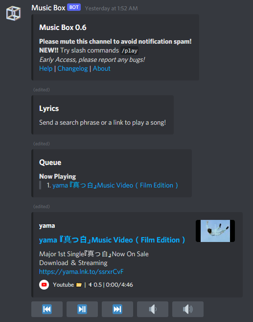

# Music Box

Music Box is a discord streaming bot designed to be easy to use.

Uses SponsorBlock data licensed used under CC BY-NC-SA 4.0. More details: <https://sponsor.ajay.app/>

**Features:**

- Play music from Youtube.
- Search Youtube & Youtube Music from the bot.
- Skip non-music sections of the bot based on [crowdsourced data](https://sponsor.ajay.app/).
- [Discord slash commands](https://blog.discord.com/slash-commands-are-here-8db0a385d9e6)  eg. /play, /pause



## Setup/Installation

1. Install required software.
    - Install Python 3.7 or greater from <https://www.python.org/>
    - If you do not already Git install, install Git from [git-scm.](https://git-scm.com)

2. Clone this repository and navigate to project directory

    ```bash
    git clone https://github.com/borisliao/mbox.git
    cd mbox/
    ```

3. Install Poetry. To learn more on how to install or use Poetry, check out the Poetry documentation [here.](https://python-poetry.org)

    ```bash
    # For OSX / Linux / Bash on Windows install instructions
    curl -sSL https://raw.githubusercontent.com/python-poetry/poetry/master/get-poetry.py | python -

    # For Windows PowerShell install instructions
    (Invoke-WebRequest -Uri https://raw.githubusercontent.com/python-poetry/poetry/master/get-poetry.py -UseBasicParsing).Content | python -
    ```

4. Install project dependencies.

    ```bash
    poetry install
    ```

5. Install pre-commit to identify issues in code before committing changes.

    ```bash
    pre-commit install
    ```

6. Follow [FFmpeg Installation](https://github.com/borisliao/mbox/wiki/FFmpeg-Installation) guide.

7. Install Opus dependency.
    - For MacOS users, the easiest way is to [setup Homebrew](https://brew.sh/) and then do a `brew install opus`.
    - For Linux/Unix users, use `sudo apt-get install libopus`.

8. Follow [Setting up Bot on Discord Developer Portal](https://github.com/borisliao/mbox/wiki/Setting-up-Bot-on-Discord-Developer-Portal) guide.

9. Invite bot to server.
    - Go to Discord Developer Portal, if not already there.
    - Click on General Information tab
    - Copy the application id
    - Replace the APPLICATION_ID portion of <https://discord.com/api/oauth2/authorize?client_id=APPLICATION_ID&permissions=8&scope=bot%20applications.commands> link

## Usage

**To run the application.**

```bash
# For Windows users
python main.py

# For MacOS/Linux users
python3 main.py
```

**To run the application in debug mode.**

```bash
# For Windows users
python main.py debug

# For MacOS/Linux users
python3 main.py debug
```

*Instead of running the commands above in the terminal, you can use the [Run and Debug](https://code.visualstudio.com/docs/editor/debugging) feature already built into VSCode. The following profiles has been included within the project: Normal Mode, Debug Mode*

## Contributing

Pull requests are welcome. For major changes, please open an issue first to discuss what you would like to change.

## License

[MIT](https://choosealicense.com/licenses/mit/)
